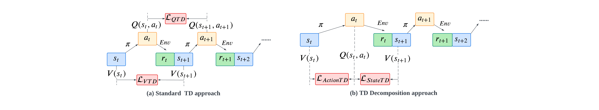
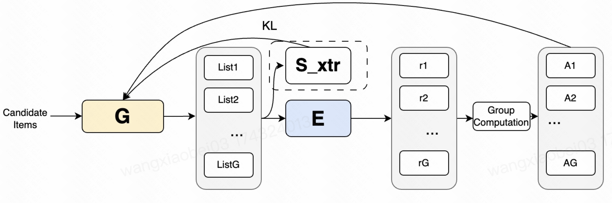
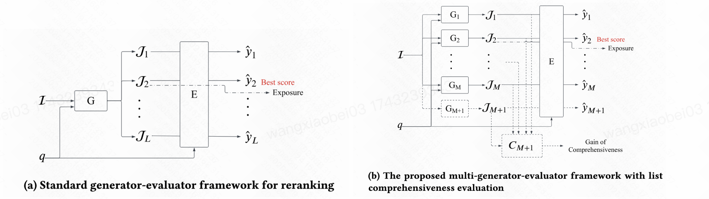
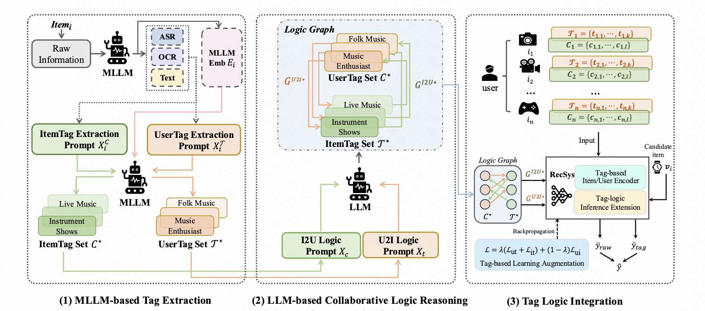
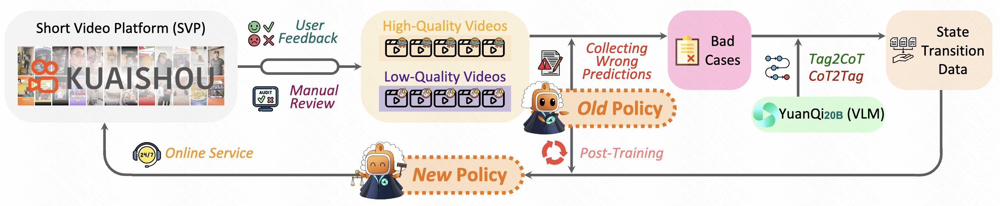
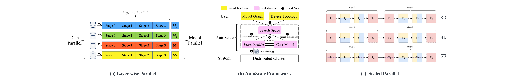

 Here is Xiaobei Wang(王潇北)’s Page. I’m currently a Algorithm Engineer in KuaiShou Technology(快手).  I am responsible for improving platform performance and user experience in Rerank stage. My core research interest is Deep Reinforcement Learning, AI for Finance, Recommender Systems, Data Mining and LLM(Large Language Model).

Before that, I was a graduate student in [Intelligent Biomimetic Design Lab(北京大学智能仿生设计实验室)](https://en.ibdl.pku.edu.cn),[College of Engineering(工学院)](https://www.coe.pku.edu.cn/) at [Peking University(北京大学)](https://www.pku.edu.cn/) , supervised by [Prof. Guangming Xie(谢广明)](https://www.coe.pku.edu.cn/teaching/all_time/7139.html).  I also joined [FinLab(北京大学金融工程实验室)](finlab.pku.edu.cn) advised by [Prof. Shaoran Li(李少然)](http://lishaoran.com) and [Prof. Xinping Li(黎新平)](https://econ.pku.edu.cn/szdw/zzjs/ybjs/sjrxx/374743.htm), exploring application of deep learning and reinforcement learning in practical Finance or Economics problems.

Education
======

- 

    
<strong>2021.09-2024.06</strong>

    
<strong>PKU(Peking University)</strong>

  - M.S. student in College of Engineering 
  - Advisor: Guangming Xie 
  - Research topics: Recommender systems, Deep Reinforcement Learning 
  - Thesis: Research on Long-term Value of Items in Reinforcement Learning-based Recommendation Systems.
- 

    
<strong>2017.09-2021.06</strong>

    
<strong>TUST(TianJin University of Science & Technology)</strong>
 
  - B.S. student in College of Mechanical Engineering 
  - Advisor: Delei Fang 
  - Research topics: Robot, Automatic Control, Mathematical Modeling 
  - Thesis: Control and simulation analysis of a hydraulically driven legged robot.
    

INDUSTRY EXPERIENCES
======
- 

    
<strong>2024.07-now </strong>

    
<strong>Kuaishou(快手科技)</strong>

  - Algorithm Engineer(算法工程师)
  - Advisor: Advisor: Xiaoyu Yang, Shuchang Liu, Xiang Li 
  - Research topics: Rerank, Deep RL, LLM

- 

    
<strong>2023.06-2024.03 </strong>

    
<strong>Kuaishou(快手科技)</strong>

  - Research Intern(研究实习生)
  - Advisor: Advisor: Shuchang Liu, Qingpeng Cai 
  - Research topics: Recommender system, Deep Reinforcement Learning
  
- 

    
<strong>2023.03-2023.06 </strong>

    
<strong>ByteDance(字节跳动)</strong>

  - Intern(算法实习生)
  - Advisor: Domgmin Ma, Tao Lin 
  - Industry topics: Large Language Model,AIGC(AI-Generated Content)

- 

    
<strong>2022.07-2023.01 </strong>

    
<strong>Shanghai AI Lab(上海人工智能实验室)</strong>

  - Research Intern(研究实习生)
  - Advisor: Yu Tang, Henjie Li 
  - Research topics: Large-scale training frameworks

Projects
======

**RL4Rec**

- **[Future Impact Decomposition in Request-level Recommendations](https://arxiv.org/abs/2401.16108)** (Work was done at Kuaishou Technology & Intelligent Biomimetic Design Lab in Peking University) 
  
  - We specify the challenge of inconsistency between users' item-wise view and the recommender system's list-wise view. To solve the challenges mentioned above, we propose an item-decomposed advantage actor-critic framework and verify its superiority on multiple public datasets and an online A/B test. 
  - The paper is accepted by KDD 2024(Ads Track)
  
  
  

- **[Value Function Decomposition in Markov Recommendation Process](https://arxiv.org/abs/2501.17409)** (Work was done at Kuaishou Technology & Intelligent Biomimetic Design Lab in Peking University) 
  
  - We specify the challenge of sub-optimal TD learning under the mixed random factors from policy and user environment and propose a decomposed TD learning framework that separately addresses the two random factors and empirically shows its superiority in online MRP.  
  - The paper is accepted by WWW 2025(research Track)
 

- **Enhancing Generator Performance via GRPO-driven Evaluator Guidance** (Working in Kuaishou Technology) 
  
  - Reranking suffers from sample selection bias due to exposed lists and the generator's unawareness of the evaluator's optimal points. We obtain counterfactual labels from the evaluator, and perform contrastive learning with unexposed lists . The evaluator guide the generator to learn superior recommendation strategies with GRPO.

* * *

**ReRank**

- **Comprehensive List Generation for Multi-Generator Reranking** (Work was done at Kuaishou Technology) 

  - We presents a multi-generator-evaluator (MG-E) framework for the reranking task in recommender systems, aiming to address the limitations of existing single - generator model. We introduces the List Comprehensiveness (LC) metric to evaluate list diversity and proposes the Complementary List Generation (CLIG) technique to automatically find complementary generators.

  - The paper is submitted to  SIGIR 2025

- **KuaiReank: A Benchmark for Generator-Evaluator paradigm ReRank** (Working in Kuaishou Technology) 
  - We have devised a two-stage re-ranking benchmark. Aiming to align with industrial practices, in the context of the dataset, we presented desensitized XTR features for precision in the later stage of the recommendation pipeline. We implemented the multi-generator strategy and sequence value modeling for evaluator.
  

* * *

**LLM**

- **Tag-based Collaborative Logic Filtering in Recommender Systems** (Work was done at Kuaishou Technology) 

  - We leverage LLMs to describe users and videos via tags. Our proposed logical model predicts user - item compatibility based on tag features. By exploring tag - based matching, we achieve interpretable recommendations and break the information bubble by uncovering users' latent interests.

  - The paper is submitted to SIGIR 2025

- **VLM as Policy: Common-Law Content Moderation Framework for Short Video Platform** (Work was done at Kuaishou Technology) 
 
  - we present a novel approach that leverages large language models (LLMs) for video understanding and Chain of Thought (CoT) reasoning to automate the review of non - compliant videos. Additionally, we open - source the toxicity dataset, establishing it as a benchmark for ecological governance.

  - The paper is submitted to KDD 2025(Ads Track)

- **AutoScale: Automated Training and Evaluating Large-scale Models with Extendable Modules beyond 3D Parallel** (Work was done at Shanghai AI Lab) 

  - We propose a novel framework, AutoScale, getting rid of the dependence on the mathematical models of current auto parallel algorithms.
  - AutoScale consists of three extendable modules, namely Search Space, Cost Model, and Search Module, which regards the 3D Parallel from a unified formulation and utilizes paralleled search algorithms to scale search modules automatically.
  - 
- **LLM(Large Language Model) for TikTok E-Commerce Network Broadcast** (Work was done at ByteDance) 
  - We prompt LLM to generate product titles based on product information.
  - we conduct research on the current status and key technologies of Chinese open-source large language models, such as ChatGLM.
  - We fine-tune a smaller version of the LLM with the dataset generated by LLM and collected live streaming text.

<!-- - **Financial Text Analysis and Stock Image Forecasting** (Work was done at Finlab in Peking University) 

  - We conduct a research project merging ML, NLP to analyze the impact of news text on multiple stocks and investigate the correlation between textual information and stock performance.
  - We implement image analysis to generate stock Candlestick chart images, assessed different models for accuracy, and leveraged predictive factors to construct a profitable investment portfolio.）-->
  
AWARDS & HONORS
------
- 2024  Outstanding Graduate Student Award of Peking university
- 2023	Award for Ubiquant Scholarship of Peking university.
- 2023	Award for Academic Excellents of Peking university.
- 2022  Champion of the 11th Capital University's Dragon Boat Championships 
- 2022	Award for Contribution in Student Organizations of Peking university.
- 2022	Award for Kangming Wu Foundation Scholarship of Peking university.
- 2020  Award for First Class Scholarship in TUST.
- 2019	First Prize in TianJin Contest District in China Undergraduate Mathematical Contest in Modeling.
